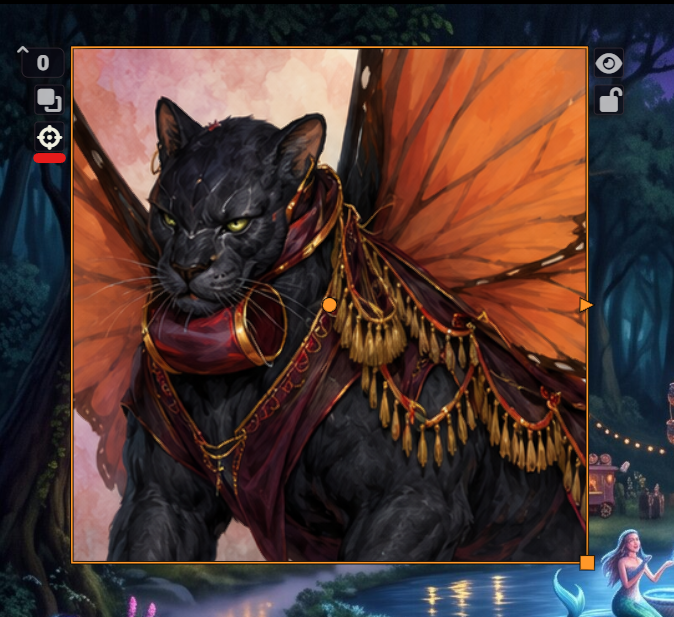
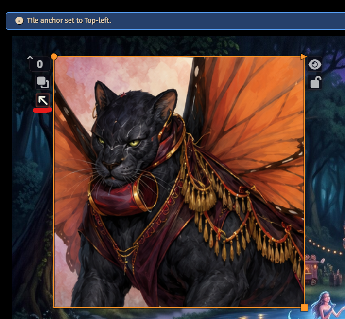

# Tile Anchor Toggle

Tile Anchor Toggle is a Foundry VTT module for version 14 that adds a quick control to the Tile HUD for switching a tile's resize anchor between **center** and **top-left**.

Foundry VTT v14 uses the tile texture anchor when resizing tiles. For users who prefer the older top-left anchored resize behavior, this module provides a one-click toggle directly on the selected tile.

## Features

- Adds an anchor toggle button to the Tile HUD.
- Switches tiles between center anchoring and top-left anchoring.
- Preserves the tile's visual position when switching anchors.
- Supports rotated tiles.
- Works with image and video tiles.
- Prevents changes to locked tiles until they are unlocked.

## Installation

Install the module in Foundry VTT using this manifest URL:

```text
https://github.com/SleepyBandit/tile-anchor-toggle/releases/latest/download/module.json
```

After installation, enable **Tile Anchor Toggle** in your world's **Manage Modules** menu.

## Usage

1. Log in as a GM.
2. Open the Tiles layer.
3. Select a tile.
4. Use the anchor button on the left side of the Tile HUD.
5. Resize the tile normally.

The button icon shows the tile's current anchor mode:

| Icon | Anchor mode | Meaning |
|---|---|---|
| Crosshairs | Center | The tile resizes around its center anchor. |
| Up-left arrow | Top-left | The tile resizes from a top-left anchor. |

### Center anchoring

When a tile is using center anchoring, the Tile HUD shows the crosshairs icon.



### Top-left anchoring

Clicking the anchor button switches the tile to top-left anchoring. The HUD icon changes to an up-left arrow, and Foundry shows a confirmation notification.



The module updates the tile's `texture.anchorX` and `texture.anchorY` values and adjusts the tile position so its visible footprint stays in place.

## Compatibility

- Minimum Foundry VTT version: 14
- Verified Foundry VTT version: 14.363

## Notes

- Custom anchor values are treated as custom; clicking the button sets the tile to top-left anchoring.
- Locked tiles must be unlocked before their anchor can be changed.
- This module does not modify Foundry core files.

## License

MIT License. See [LICENSE](LICENSE).
